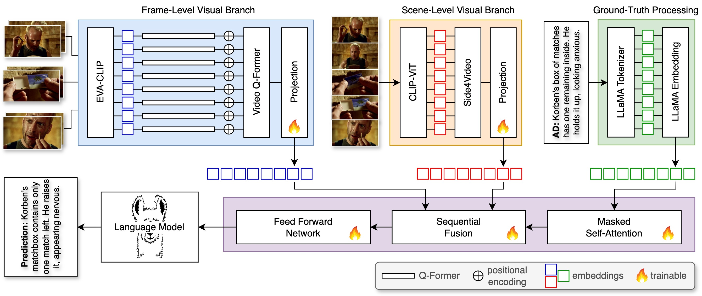

# DANTE-AD: Dual-Vision Attention Network for Long-Term Audio Description

<div>

This repository contains the official implementation of:

"DANTE-AD: Dual-Vision Attention Network for Long-Term Audio Description"
Accepted at CVPR Workshop on AI for Content Creation (AI4CC) 2025 [[arXiv]](https://arxiv.org/abs/2503.24096)

<div>

## Overview

DANTE-AD is a Transformer-based video description model designed to improve contextual understanding for audio description (AD). The model explicitly integrates two complementary visual representations:

- Frame-level features capturing fine-grained visual details

- Scene-level features capturing long-term and high-level context

These are sequentially fused in a dual-vision attention architecture, enabling more coherent and context-aware descriptions across scene boundaries.

<p align="center" width="100%">
<a target="_blank"></a>
</p>

<div>

## Environment Setup

1. Clone the repo and install required packages:
```bash
git clone https://github.com/AdrienneDeganutti/DANTE-AD.git
cd DANTE-AD/
```
2. Create and activate the Conda environment
```bash
conda env create -f environment.yml
conda activate dante
```
3. Install PyTorch
```bash
pip install torch torchvision --index-url https://download.pytorch.org
```
4. Configure dataset paths

- Update the paths to your dataset in ```src/configs/datasets/cmd_ad.yaml```

```bash
CMD-AD/
├── labels/                          # Ground-truth AD annotations
│   ├── train.tsv
│   └── eval.tsv
├── s4v_features/                    # Scene-level S4V embeddings
│   ├── 2011/
│   │   └── *.pt
│   ├── ...
│   └── 2019/
├── video_qformer_features/          # Frame-level Video Q-Former embeddings (offline loading)
│   ├── 2011/
│   │   └── *.pt
│   ├── ...
│   └── 2019/
├── videos/                          # Segmented CMD-AD videos (online feature extraction)
│   ├── 2011/
│   │   └── *.mkv
│   ├── ...
│   └── 2019/

```

<div>

## Data Preparation

### Step 1: Scene-level features (S4V)

The scene-level S4V features provided are processed from the action recognition module of [Side4Video](https://github.com/HJYao00/Side4Video) pre-trained on Kinetics-400.

(step-by-step instructions coming soon)

We provide our pre-computed scene-level features in the Dataset section.

### Step 2: Frame-level features

Frame-level features can be handled in two ways:

**Option 1: Online feature extraction.**

- Set ```"load_frame_features": false``` in the training config file ```src/configs/training_config.json```
- Set video directory path ```videos_dir``` in the dataset config file ```src/configs/datasets/cmd_ad.yaml```

**Option 2: Offline feature loading.**

- Set ```"load_frame_features": true``` in the training config file ```src/configs/training_config.json```
- Set feature path ```video_qformer_ft``` in the dataset config file ```src/configs/datasets/cmd_ad.yaml```

We provide our pre-computed frame-level features in the Dataset section.

<div>

## Dataset

The dataset used in this paper is a reduced version of the [CMD-AD dataset](https://www.robots.ox.ac.uk/~vgg/research/autoad/#datasets). Due to various encoding issues with the raw videos, our version of the CMD-AD dataset used in this paper is reduced from approximately 101k down to 96k AD segments as shown in the table below.

|                    | CMD-AD        | DANTE-AD      |
| -------------------| ------------- | ------------- |
| Total AD segments  | 101,268       | 96,873        |
| Train AD segments  | 93,952        | 89,798        |
| Eval AD segments   | 7,316         | 7,075         |

### Pre-processed data

To improve computational efficiency, we pre-compute the frame-level (CLIP) and scene-level (S4V) visual embeddings offline. We provide the pre-processed visual embeddings and ground-truth annotations below.

For the frame-level CLIP features, we process the following modules offline: EVA-CLIP feature extraction, Q-Former, positional embedding and Video Q-Former. The output of the Video Q-Former has shape ([batch_size, 32, 768]). This can be reproduced by running the data-preparation step 2 online frame-level feature extraction instructions above.

The S4V features we provide are the output of the Side4Video module after Global Average Pooling over each frame within the video sequence. The output features are of shape ([batch_size, 1, 320]).

**Download here: [Preprocessed CMD-AD](https://1drv.ms/f/c/fd682d23eb414404/EoazITd9Gs1GoC94BA54Pk0BK6pwCdGaPYBkVXfJN0DQTw)**


<div>

## Training

- Set the path to your checkpoint in ```src/configs/video_llama/model_config.yaml```

- Set ```do_train: true``` in ```src/configs/training_config.json```

Run training:
```bash
python main.py --config src/configs/training_config.json
```

<div>

## Model Checkpoints

|                             | Download Link                                                                       | 
| ----------------------------| ----------------------------------------------------------------------------------- |
| Base Movie-LLaMA2 weights   | [Movie-Llama2 weights](https://github.com/TengdaHan/AutoAD/tree/main/autoad_iii)    |
| DANTE-AD trained checkpoint | [DANTE-AD model checkpoint](https://1drv.ms/u/c/fd682d23eb414404/EWrhWYNLGJ9JutiV1hCIY5sB3eoTD_1zMex0nZA5pIOkSw)                                                                     | 

## Evaluation

- Set the path to the checkpoint in ```src/configs/video_llama/model_config.yaml```

- Set ```do_train: false``` and ```do_eval: true``` in ```src/configs/training_config.json```

Run evaluation:
```bash
python main.py --config src/configs/training_config.json
```

**DANTE-AD output on the CMD-AD dataset: [eval-results.tsv](https://1drv.ms/u/c/fd682d23eb414404/ETQvWuMKDMFPnJOg0MouhnUBHeNiZeZOFLjlLxL5JuXieg)**

<div>

## Acknowledgment

This work builds upon the following projects:
- [Video-LLaMA](https://github.com/DAMO-NLP-SG/Video-LLaMA.git): An Instruction-tuned Audio-Visual Language Model for Video Understanding
- [AutoAD](https://github.com/TengdaHan/AutoAD): Movie Description in Context
- [GRIT](https://github.com/davidnvq/grit): Faster and Better Image-Captioning Transformer

<div>

## Citation

If you find our project useful, please kindly cite the paper with the following bibtex:
```bibtex
@article{deganutti2025dante,
  title={DANTE-AD: Dual-Vision Attention Network for Long-Term Audio Description},
  author={Deganutti, Adrienne and Hadfield, Simon and Gilbert, Andrew},
  booktitle={IEEE/CVF Conference on Computer Vision and Pattern Recognition - Workshop on AI for Content Creation (AI4CC'25)},
  year={2025}
}
```
